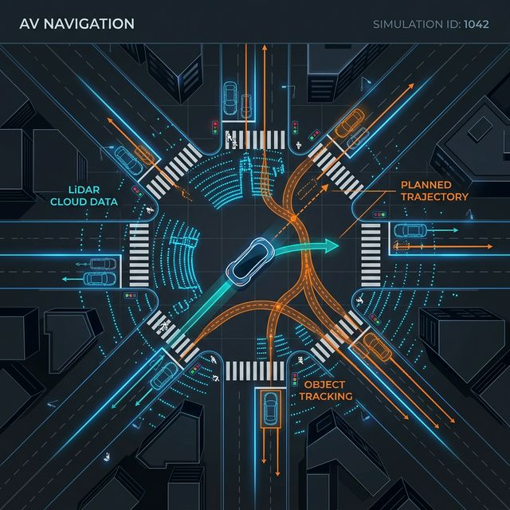
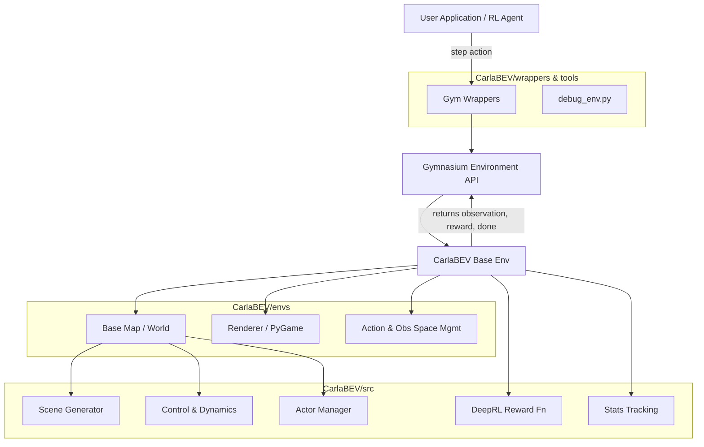

<div align="center">

# CarlaBEV 🚗🗺️

**A Custom Simulation Framework for Autonomous Vehicle Motion Planning and Deep Reinformecent Learning**

[](https://www.python.org/downloads/release/python-3120/)
[](https://gymnasium.farama.org/)
[](https://www.pygame.org/)

</div>

---

## 📌 Overview

**CarlaBEV** is a custom simulation environment designed from the ground up to support research and development in motion planning for self-driving vehicles. Built on top of [Farama Gymnasium](https://gymnasium.farama.org/) and lightweight [PyGame](https://www.pygame.org/) 2D rendering, it provides a highly customizable and efficient platform for testing Deep Reinforcement Learning (DeepRL) agents.

Whether you're exploring complex Bird's Eye View (BEV) state representations, structured vector observations, or custom tracking logic, CarlaBEV offers the modularity needed to get experiments running quickly.

<!-- Hero Banner Image Placeholder -->
<div align="center">
  
</div>

---

## ✨ Key Features

- 🎮 **Standard API Compatibility:** Implements the Gymnasium interface, enabling drop-in replaceability with standard Deep RL libraries (Stable Baselines3, CleanRL, etc.).
- 👁️ **Multi-modal Observation Spaces:** Toggle between rich **`bev`** (Bird's Eye View) rendering and low-dimensional **`vector`** formats via configuration.
- 🕹️ **Flexible Action Spaces:** Built-in abstraction for both **`discrete`** and **`continuous`** control spaces.
- 📈 **DeepRL Integration Toolkit:** Includes custom reward functions (e.g., `CaRLRewardFn`), experiment loggers, and wrappers (like `rgb_to_semantic`) out of the box.
- 🏗️ **Scenario Designer (Coming Soon):** Future support for a built-in `scene_designer.py` and `scene_generator` to quickly mock up custom urban scenarios.

---

## 🚀 Getting Started

### Prerequisites

I recommend using [uv](https://github.com/astral-sh/uv) to manage the Python environment and dependencies for blazingly fast installations.

### Installation

1. Clone the repository and navigate into it:

   ```bash
   git clone https://github.com/yourusername/carlabev-env.git
   cd carlabev-env
   ```

2. Initialize and sync the environment:
   ```bash
   uv sync
   ```

### Running the Debug Environment

You can jump right in and test the framework manually or watch the default scenario unfold using the provided debugging tool:

```bash
uv run CarlaBEV/tools/debug_env.py
```

This will launch a `PyGame` window, initialize the `red_light_runner` scene, and begin stepping the generic environment.

---

## 🗺️ System Architecture

CarlaBEV is structured modularly. The architecture enables users to build custom environments, scenes, and behavior by composing existing logical managers or writing flexible reward functions.



### Module Breakdown:

1. **`CarlaBEV/envs/`**: The Core Gymnasium environment (`carlabev.py`), spaces definitions, rendering engine, and core World logic (`world.py`).
2. **`CarlaBEV/src/`**: Logic separation layers. Contains physical controllers (`control/`), deep reinforcement learning tooling (`deeprl/`), scene orchestration (`scene/`), and actor management.
3. **`CarlaBEV/tools/`**: Included utilities such as the `debug_env.py` executable for human-playable debugging.
4. **`CarlaBEV/wrappers/`**: Standard RL gym environment modifiers (e.g. clipping reward, `rgb_to_semantic.py`).

---

## 🛠️ Configuration and Customization

The core configuration is strictly typed and managed to ensure reproducible environments. When initializing the environment, key configurations like spatial layout, action formats, and view dimensions can be quickly swapped.

```python
from CarlaBEV.envs import make_env
import numpy as np
from random import choice

# Define custom arguments/options
options = {
    "scene": choice(["red_light_runner"]),
    "num_vehicles": 25,
    "route_dist_range": [30, 100],
    "reset_mask": np.array([True], dtype=bool)
}

# The make_env helper spins up your scenario
envs = make_env(cfg)
obs, info = envs.reset(options=options)
```

---

## 📄 License
